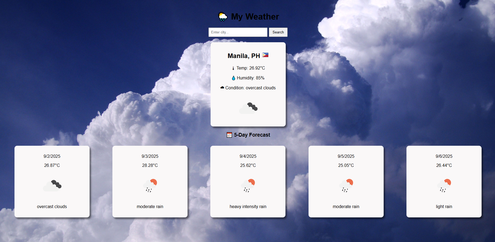

# My Weather

A simple and responsive weather application built with **React.js** that allows users to search for any city and view real-time weather information. The app fetches data from the **OpenWeatherMap API** and displays temperature, conditions, and a 5-day forecast with custom background images for each weather condition.  

## 🚀 Live Demo
🔗 [View on Netlify](https://my-weather-react-ph.netlify.app/)  

---

## ✨ Features
- 🌍 Search for weather by city name  
- 🌡 Displays temperature, humidity, and conditions  
- 📅 5-day weather forecast  
- 🎨 Dynamic background images depending on weather (Clear, Clouds, Rain, etc.)  
- 💾 Remembers your last searched city using LocalStorage  
- ⚡ Fast, mobile-friendly UI  

---

## 🛠️ Tech Stack
- **React.js** (Create React App)  
- **OpenWeatherMap API**  
- **CSS** for styling  
- **Netlify** for deployment  

---

## 📸 Screenshots

### Homepage  


---

## ⚙️ Installation & Setup

Clone the repository and install dependencies:

```bash
# Clone repo
git clone https://github.com/lawr3ncey/weather-react-app

# Go into project folder
cd weather-app

# Install dependencies
npm install

# Run locally
npm start

🔑 Environment Variables

This project uses the OpenWeatherMap API.
You’ll need an API key:

Sign up at OpenWeatherMap
.

Create a .env file in your project root.

Add the following line: REACT_APP_WEATHER_API_KEY=e1cab25a7fe1904b0e58d01ae824c640

🌐 Deployment (Netlify)

Push your project to GitHub.

Go to Netlify
.

Select New site from Git.

Connect your GitHub repo.

Set Build Command = npm run build and Publish directory = build/.

Click Deploy 🚀

📌 Future Improvements

Add geolocation support to detect user’s current city

Show hourly forecast

Add dark mode toggle

Improve UI with animations

📄 License

This project is licensed under the MIT License – feel free to use and modify!

👨‍💻 Author

Developed by Babelonia Lawrence ✨ Email: babelonialawrence@gmail.com